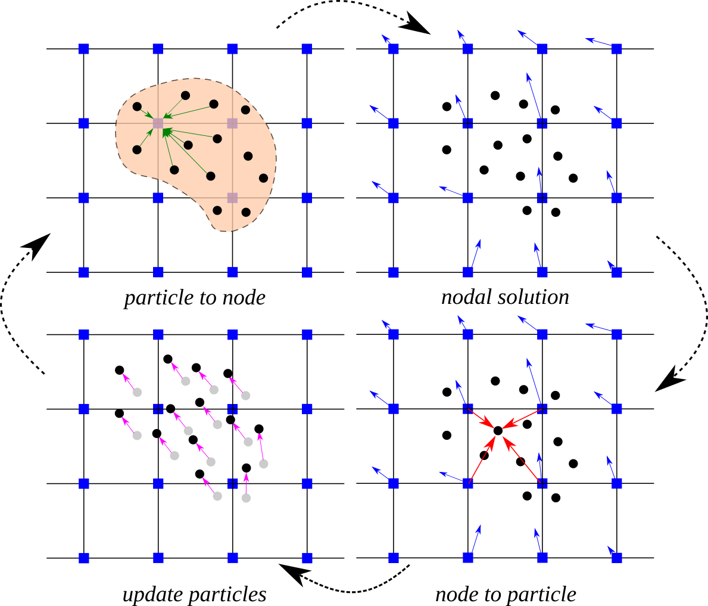
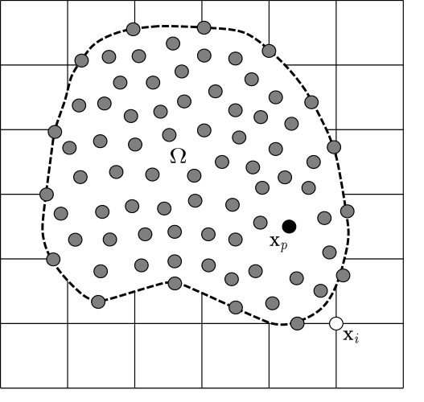

# An introduction to the Material Point Method
In continuum mechanics, there are two main descriptions of material motion: Lagrangian and Eulerian. 
The Lagrangian (material) description uses the initial configuration (i.e. at time, $t = 0$) to describe the physical quantities and the deformation state of a continuum body. So, the emphasis is given to individual particles in Lagrangian kinematic description. 
On the other hand, the Eulerian (or spatial) approach describes the motion of a continuum body with respect to the current coordinates and time. 
The spatial description therefore focuses on a specific position in space at current time.

The Material Point Method (MPM) is a hybrid Eulerian-Lagrangian approach, which uses moving material points on  a fixed computational background grid. 
The MPM is a particle based method that represents the material as a collection of material points, and their deformations are determined by Newton’s laws of motion. 
This approach is very effective particularly in the context of large deformations.

> Illustration of the MPM algorithm: (1) A representation of material points overlaid on a computational grid. 
Arrows represent material point state vectors (mass, volume, velocity, etc.) being projected to the nodes of the computational grid. 
(2) The equations of motion are solved onto the nodes, resulting in updated nodal velocities and positions. 
(3) The updated nodal kinematics are interpolated back to the material points. 
(4) The state of the material points is updated, and the
computational grid is reset

## Motion of deformable body

It is essential to consider a proper description of motion in finite deformation analysis. In fact, material point method describes the behaviour of a deformable body in an updated Lagrangian frame. 

> Motion of a deformable body in continuum mechanics

The figure shows the general motion of a continuum body. The material particles are labelled with the position $\mathbf{X}$ at their initial configuration (time $t = 0$). At current configuration at time $t = t$, these particles are located at positions $\mathbf{x}$. Motion between the initial and the current positions is mathematically described by a mapping function, $\phi$ as

$$\mathbf{x} = \phi (\mathbf{X},t)$$

and

$$\mathbf{X} = \phi (\mathbf{X},0)$$

Despite the fact that the equations are solved in  Lagrangian framework, the spatial quantities in MPM are expressed in terms of the spatial position, \textbf{x}. Hence, the displacement, $\mathbf{u}(\mathbf{x},t)$, velocity, $\mathbf{v}(\mathbf{x},t)$ and the acceleration, $\mathbf{a}(\mathbf{x},t)$ can be defined as

$$
\mathbf{u}(\mathbf{x},t) = \mathbf{x} - \mathbf{X}
$$

$$
\mathbf{v}(\mathbf{x},t) = \dfrac{d \mathbf{u}}{dt} (\mathbf{x},t)
$$

$$
\mathbf{a}(\mathbf{x},t) = \dfrac{d \mathbf{v}}{dt} (\mathbf{x},t)
$$

where $\dfrac{d}{dt} = \dfrac{\partial}{\partial t} + \mathbf{v} \cdot \nabla$ is the material time derivative.

In large deformation analysis with inelastic material behaviour, it is usually difficult to follow the deformation history. Hence, the material motion is usually described in terms of small increments of the deformation and the stress-strain relationships are defined in incremental form. The symmetric small strain tensor, $\pmb{\epsilon}$ is given by

$$\epsilon = \dfrac{1}{2} \big( \nabla \mathbf{u} + (\nabla \mathbf{u})^T \big)$$ 

with its rectangular Cartesian components

$$
\pmb{\epsilon}_{ij} = \dfrac{1}{2} \bigg( \dfrac{\partial \mathbf{u}_i}{\partial \mathbf{x}_j} + \dfrac{\partial \mathbf{u}_j}{\partial \mathbf{x}_i} \bigg)
$$

In the viscous behaviour of materials or in most plasticity theories, the equations are generally formulated in terms of the rate of deformation. The rate of deformation tensor is defined as

$$
\mathbf{D} = \dfrac{1}{2} \big(L + L^T \big)
$$

where $L = \nabla \mathbf{v}$ is the velocity gradient.

The rectangular Cartesian components of the rate of deformation tensor are given by 

$$
\mathbf{D}_{ij} = \dfrac{1}{2} \bigg( \dfrac{\partial \mathbf{v}_i}{\partial \mathbf{x}_j} + \dfrac{\partial \mathbf{v}_j}{\partial \mathbf{x}_i} \bigg)
$$

## Governing equations

Material motion is mathematically represented by the conservation laws expressed in differential form. For the problems considered in this study, the governing equations include only the conservation of mass and momentum.

The conservation of mass which is also referred to as the continuity equation (\ref{mass-conservation}) states that mass of a closed system (i.e. closed to all transfers of matter and energy) must remain constant.   

$$
\dfrac{d \rho}{dt} + \rho \nabla \cdot \mathbf{v} = 0
$$

The linear momentum balance equation is also called as the equation of motion and it is derived by applying the Newton's second law to a continuum body.  

$$
\rho \dfrac{d \mathbf{v}}{dt} = \nabla \cdot \pmb{\sigma} + \rho \mathbf{b}
$$

where $\rho(\mathbf{x},t)$ is the mass density, $\pmb{\sigma}(\mathbf{x},t)$ is the symmetric Cauchy stress tensor and $\mathbf{b}(\mathbf{x},t)$ is the external body force.

## Weak form and spatial discretisation

MPM describes the whole material domain, $\Omega$ with a set of Lagrangian material points that are tracked throughout the deformation process. 
An Eulerian grid is used to solve the equation of motion. 
The grey circles are the material points $x_{p}$, where _p_ represents a material point, and the computational nodes are the points of intersection of the grid (denoted as $X_{i}$, where _i_ represents a computational node). 
The MPM involves discretising the domain, $\Omega$, with a set of material points. 
The material points are assigned an initial value of position, velocity, mass, volume, and stress, denoted as 
$\mathbf{x}_{p}$, $\mathbf{\mathit{v}}_{p}$, $\mathit{m}_{p}$, $\mathbf{V}_{p}$, and $\sigma_{p}$. 
Depending on the material being simulated, additional parameters, like pressure, temperature, pore-water pressure, etc., are specified at the material points. 
The material points are assumed to be within the computational grid which for ease of computation, is assumed to be a Cartesian lattice. 
At every time step $\mathit{t}_{k}$, the MPM computation cycle involves projecting the data, such as position, mass, and velocity, from the material points to the computational grid using the standard nodal basis functions, called the _shape functions_, derived from the position of the particle with respect to the grid. 
Gradient terms are calculated on the computational grid, and the governing equation, i.e. the equation of motion, is solved with the updated position and velocity values mapping back to the material points. 
The mesh is reinitialised to its original state and the computational cycle is repeated. 

The material domain is discretized in to a $n_p$ number of points in its initial configuration, $\Omega^0$ with its material coordinates $\mathbf{x}_p^0$ at time $t=0$ and $\mathbf{x}_p^t$ at time $t$ $(p = 1, 2, ..., n_p)$. Each material point represents an infinitesimal mass element with a fixed mass $M_p$ through out the computation. Hence, mass density can be expressed as

$$
\rho(\mathbf{x},t) = \sum_{p=1}^{n_p} M_p \delta (\mathbf{x} - \mathbf{x}_p^t)
$$
where $\delta$ is the Dirac delta function.

The background mesh consists of a total number of nodes, $n_n$ that are located at $\mathbf{x}_i$ with shape functions $N_i(\mathbf{x})$ ($i = 1,2,...,n_n$). The position, displacement, velocity and acceleration at any point in the continuum body are approximated using the shape functions similar to the finite element method.

The coordinates of a point at any given time is approximated using the nodal basis functions as

$$
\mathbf{x} = \sum_{i=1}^{n_n} \mathbf{x}_i N_i(\mathbf{x})
$$ 

Similarly, the displacement, velocity and acceleration fields of a point in the material domain at any given time $t$ can be approximated by

$$
\mathbf{u} (\mathbf{x},t) = \sum_{i=1}^{n_n} \mathbf{u}_i(t) N_i(\mathbf{x})
$$

$$
\mathbf{v} (\mathbf{x},t) = \sum_{i=1}^{n_n} \mathbf{v}_i(t) N_i(\mathbf{x})
$$

$$
\mathbf{a} (\mathbf{x},t) = \sum_{i=1}^{n_n} \mathbf{a}_i(t) N_i(\mathbf{x})
$$

The fixed mass, $m_p$ at the material points in equation implies that the equation of conservation of mass is automatically satisfied. 

Following the finite element method, the weak form of the linear momentum balance equation is obtained by multiplying the momentum conservation equation by a test function, $\delta \mathbf{v}$  and integrating over the current configuration, $\Omega$ as

$$
\int_{\Omega} \delta \mathbf{v} \cdot \rho \mathbf{a} \hspace{3pt} d\Omega = \int_{\Omega} \delta \mathbf{v} \nabla \cdot \pmb{\sigma} \hspace{3pt} d\Omega + \int_{\Omega} \delta \mathbf{v}  \cdot \rho \mathbf{b} \hspace{3pt} d\Omega
$$

where $d\Omega$ is the differential volume.

The test function, $\delta \mathbf{v}$ is also expressed using the nodal basis functions as in equation.
 
$$
\delta \mathbf{v} (\mathbf{x},t) = \sum_{i=1}^{n_n} \delta \mathbf{v}_i(t) N_i(\mathbf{x})
$$

Applying integration by parts and the divergence theorem to the term involving the stress, weak form equation can be rewritten as

$$
\int_{\Omega} \rho \delta \mathbf{v} \cdot \mathbf{a} \hspace{3pt} d\Omega = -\int_{\Omega} \nabla \delta \mathbf{v} : \pmb{\sigma} \hspace{3pt} d\Omega + \int_{\partial \Omega_\Gamma} \delta \mathbf{v} \hspace{3pt} \cdot \mathbf{t} \hspace{3pt} dS + \int_{\Omega}  \rho \delta \mathbf{v}  \cdot \mathbf{b} \hspace{3pt} d\Omega
$$

where $dS$ is the differential surface, $\mathbf{t} = \pmb{\sigma} \cdot \mathbf{n}$ is the prescribed surface traction and $\mathbf{n}$ is the unit normal vector to the boundary.

Substituting acceleration equations and test function in the weak form equation gives

$$
\begin{aligned}
\sum_{i,j=1}^{n_n} \int_{\Omega} \rho N_i(\mathbf{x}) N_j(\mathbf{x}) \mathbf{a}_j(t) \hspace{3pt} d\Omega = & -\sum_{i=1}^{n_n} \int_{\Omega} \nabla N_i(\mathbf{x}) : \pmb{\sigma} (\mathbf{x},t) \hspace{3pt} d\Omega \\
& + \sum_{i=1}^{n_n} \int_{\partial \Omega_\Gamma} N_i(\mathbf{x}) \mathbf{t}(\mathbf{x},t) \hspace{3pt}dS \\
& + \sum_{i=1}^{n_n} \int_{\Omega} \rho N_i(\mathbf{x}) \mathbf{b}(\mathbf{x},t) \hspace{3pt} d\Omega
\end{aligned}
$$

In contrary to the Gauss integration in FEM, MPM considers the locations of material particles as the integration points. This converts the integrals in weak form equation into sums over the material particles. As a result, the semi discrete momentum equation can be written in the form of 

$$
\sum_{j=1}^{n_n} M_{ij} \mathbf{a}_j = \mathbf{F}_i^{int} + \mathbf{F}_i^{ext}
$$

where $M_{ij}$ is the consistent mass matrix, $\mathbf{F}_i^{int}$ is the internal force vector and $\mathbf{F}_i^{ext}$ is the external force vector. 

The consistent mass matrix is given by 
$$
M_{ij} = \sum_{p=1}^{n_p} N_i(\mathbf{x}_p) N_j(\mathbf{x}_p) M_p
$$

The internal force vector computed at the grid nodes is written as
$$
\mathbf{F}_i^{int} = - \sum_{p=1}^{n_p} \nabla N_i(\mathbf{x}_p) : \pmb{\sigma}(\mathbf{x}_p,t) V_p
$$

and the external force vector is
$$
\mathbf{F}_i^{ext} = \int_{\partial \Omega_\Gamma} N_i(\mathbf{x}) \mathbf{t} (\mathbf{x},t) \hspace{3pt} dS + \sum_{p=1}^{n_p} N_i(\mathbf{x}_p) \mathbf{b}(\mathbf{x}_p,t)M_p
$$

In the standard MPM formulation, the consistent mass matrix is generally replaced by the lumped masses at nodes, $m_i$. This practice leads to a straightforward computation of the nodal acceleration in semi-discrete formulation.

## Time integration and numerical implementation 

In order to obtain the fully discrete form of the governing equations, semi-discrete equation must be discretized in time. MPM is well known for its explicit dynamic formulation which employs the forward Euler (explicit) time integration scheme. This follows that nodal acceleration in semi-discrete equation is solved explicitly using the known internal and external forces at the current configuration at time $t$ as 

$$
m_i^t \mathbf{a}_i^t = \mathbf{F}_i^{t,int} +\mathbf{F}_i^{t,ext}
$$ 

\noindent where $m_i^t$ is lumped mass at the nodes.

The implicit velocity, $\mathbf{v}_i^{t+\triangle t}$ is computed as 

$$
\mathbf{v}_i^{t+\triangle t} = \mathbf{v}_i^t + \triangle t \hspace{3pt} \mathbf{a}_i^t
$$

\noindent where $\triangle t$ is the time increment.

The explicit time integration is computationally convenient. However, it is a conditionally stable scheme which restricts the time step size to ensure numerical stability. Consequently, the time step must satisfy the Courant–Friedrichs–Lewy (CFL) condition. This is a necessary condition for convergence in explicit time marching numerical methods.

For one dimensional case, the CFL condition has the following form,

$$
C = \dfrac{u \Delta t}{\Delta x} \leq C_{max}
$$

\noindent where $u$ is the characteristic wave speed,  $\Delta x$ is the spacing of the grid, $\Delta t$ is the time step size and $C_{max}$ is the maximum Courant number which is unity for most explicit methods. 

In order to solve the fully discrete form and velocity update equation at the grid nodes,  mass and velocity carried by the material points must be transferred to the background grid. At the beginning of each Lagrangian time step,  particle mass is mapped to the nodes using

$$
m_i^t = \sum_{p=1}^{n_p} N_i(\mathbf{x}_p^t) M_p
$$  

Nodal velocity at each time step is computed by mapping particle momentum as

$$
\mathbf{v}_i^t = \dfrac{\sum_{p=1}^{n_p}M_p \mathbf{v}_p^t N_i(\mathbf{x}_p^t)}{m_i^t}
$$

With acceleration, $\mathbf{a}_i^t$ solved at the nodes using fully discrete form equation, the material points are updated while the grid is assumed to move with the computed velocity field. Moving of material points through the grid completes the Lagrangian description used in the MPM formulation.

Finally, the velocity and the position of material points are updated by

$$
\mathbf{v}_p^{t + \triangle t} = \mathbf{v}_p^t + \triangle t \hspace{3pt} \sum_{i=1}^{n_n}N_i(\mathbf{x}_p^t) \mathbf{a}_i^t
$$

$$
\mathbf{x}_p^{t + \triangle t} = \mathbf{x}_p^t + \triangle t \hspace{3pt} \sum_{i=1}^{n_n}N_i(\mathbf{x}_p^t) \mathbf{v}_i^{t + \triangle t}
$$

It should be noted from internal force equation that stress and strain are carried by the material points. This implies that the constitutive equations are applied at the material points. As a result, following the history of deformation is convenient in MPM. Similarly, the external body forces are also applied at the material points as in the external force equation. 

## Conservation properties
MPM automatically satisfies the mass conservation by assigning a constant mass to each material point. 
The momentum balance is enforced in governing equations. 
However, Bardenhagen (2002) showed that the original MPM formulation does not satisfy the energy conservation explicitly. 
It was found that the energy conservation in MPM is strongly
dependent on the two algorithms which are used to update the stress at material points.
